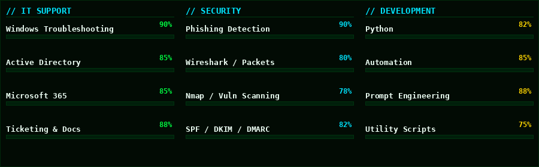

<!-- ═══════════════════════════════════════════════════════ -->

<!--              AARON ZAJICEK — PROFILE README           -->

<!-- ═══════════════════════════════════════════════════════ -->

<div align="center">


<br>

[](https://aaronzajicek.com)
[](https://linkedin.com/in/aaronkeithzajicek)
[](https://www.upwork.com/freelancers/~01b56ee65fad4009fd)
[](https://www.fiverr.com/users/aaron_zajicek)

</div>

-----

## `$ cat whoami.txt`

<div align="center">

</div>

-----

## `$ ls ./skills/`

<div align="center">

</div>

-----

## `$ ls ./projects/`

### `// BROWSER EXTENSIONS`

|ID     |Project                                                          |Description                                                                                                                                                                                             |Status    |
|-------|-----------------------------------------------------------------|--------------------------------------------------------------------------------------------------------------------------------------------------------------------------------------------------------|----------|
|`E-001`|**[PhishEye Recon](https://github.com/mrA2Z0101/PhishEye-Recon)**|Browser extension for detecting phishing, homograph attacks, and domain spoofing. Features risk scoring, brand impersonation detection, Unicode analysis, and optional VirusTotal & urlscan integration.|`● ACTIVE`|

-----

### `// APPS`

|ID     |App                |Description                                                                                                                                                                                                                                                                 |Status      |
|-------|-------------------|----------------------------------------------------------------------------------------------------------------------------------------------------------------------------------------------------------------------------------------------------------------------------|------------|
|`A-001`|**LogEye**         |Log analyzer and threat detector that ingests Windows Security and Linux auth logs, normalizes events, and surfaces findings like brute-force attacks, suspicious logins, and privilege escalation. Exports to CSV and JSON. Free CLI + paid WPF desktop GUI.               |`● DEPLOYED`|
|`A-002`|**GhostProcess**   |Real-time suspicious process scanner that enumerates all running processes, computes SHA-256 hashes, and queries VirusTotal to classify each as clean, malicious, or unknown. Features a tabbed Tkinter GUI with KPI dashboard cards, risk scoring, and persistent settings.|`● ACTIVE`  |
|`A-003`|**Cipher Sentinel**|Advanced password strength analyzer with offline SHA-1 breach hash detection (HIBP-compatible), keyboard-walk sequence detection, entropy scoring, and 10 switchable themes including SOC Nightfall, Matrix Protocol, and Cyber Neon.                                       |`● DEPLOYED`|

-----

### `// HARDWARE`

|ID     |Project                                                                     |Description                                                                                                                                                                            |Status    |
|-------|----------------------------------------------------------------------------|---------------------------------------------------------------------------------------------------------------------------------------------------------------------------------------|----------|
|`H-001`|**[Defendagotchi](https://github.com/mrA2Z0101/Defendagotchi)**             |Tamagotchi-style ESP32 cybersecurity companion with ILI9341 touchscreen. Runs real-time Wi-Fi threat scans — detecting rogue APs, deauth attacks, captive portals, and weak encryption.|`● ACTIVE`|
|`H-002`|**[PandaFense](https://github.com/mrA2Z0101/Pandafense-Cybersecurity-Tool)**|Handheld ESP32 defense tool with OLED UI, CC1101 Sub-GHz RF module, 14 Wi-Fi detectors, 10 BLE detectors, honeypot modules, and a live WebSocket WebUI at `pandafense.local`.          |`● ACTIVE`|

-----

### `// SCRIPTS — CYBERSECURITY`

```python
# Simple, practical security scripts. No bloat.
```

|Script             |What It Does                                                                                  |
|-------------------|----------------------------------------------------------------------------------------------|
|`email_analyzer.py`|SPF / DKIM / DMARC parsing, hop tracing, spoofing detection — accepts `.eml` files or stdin   |
|`port_scanner.py`  |TCP/UDP scanner with banner grabbing & service fingerprinting — zero dependencies, pure stdlib|
|`ssl_inspector.py` |SSL/TLS cert inspector — expiry, cipher suites, chain validation, JSON output                 |

-----

### `// SCRIPTS — IT`

|Script             |What It Does                                                                        |
|-------------------|------------------------------------------------------------------------------------|
|`backup_tool.py`   |Compress → upload to S3/Backblaze B2 → rotate old backups on a schedule             |
|`disk_reporter.py` |Top disk offenders, duplicate/old file detection, email alerts — zero dependencies  |
|`health_monitor.py`|Service uptime monitor — SQLite logging, Slack & email alerts on failure/recovery   |
|`net_pinger.py`    |CIDR sweep pinger — ICMP/TCP probing, latency stats, hostname resolution, watch mode|
|`sys_inventory.py` |System snapshot — CPU, RAM, OS, disk, network, processes, software — JSON/CSV export|

-----

### `// GAMES`

|ID     |Project                                  |Description                                                                                                                                                                  |Status    |
|-------|-----------------------------------------|-----------------------------------------------------------------------------------------------------------------------------------------------------------------------------|----------|
|`G-001`|**[Glitch Pong](https://glitchpong.com)**|A glitchy cyberpunk Pong remake where the ball is sentient and actively works against you. Not just the paddle — the ball itself is your enemy. Neon visuals, dystopian vibe.|`● ACTIVE`|

-----

## `$ cat stats.log`

<div align="center">


<br><br>


<br><br>


</div>

-----

## `$ cat contact.txt`

```bash
aaron@sys:~$ cat contact.txt

  EMAIL    →  mr.aaronz0101@gmail.com
  LINKEDIN →  linkedin.com/in/aaronkeithzajicek
  UPWORK   →  upwork.com/freelancers/~01b56ee65fad4009fd
  FIVERR   →  fiverr.com/users/aaron_zajicek
  PORTFOLIO→  aaronzajicek.com
  GITHUB   →  github.com/mrA2Z0101

  OPEN TO: Freelance · IT Help Desk · Security Consulting · Collaboration

aaron@sys:~$ █
```

-----

### `// ETSY STORES`

[](https://www.etsy.com/shop/ArtisticZebraDigital)
[](https://www.etsy.com/shop/RebelAgainstTheFlesh)
[](https://www.etsy.com/shop/ByteSizedWisdom)

-----

<div align="center">

`// END OF FILE — SYSTEM ONLINE — UPTIME: 99.97%`


</div>